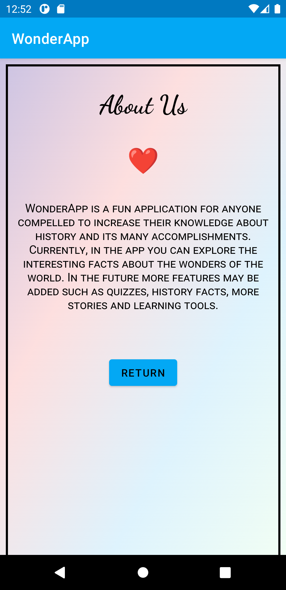
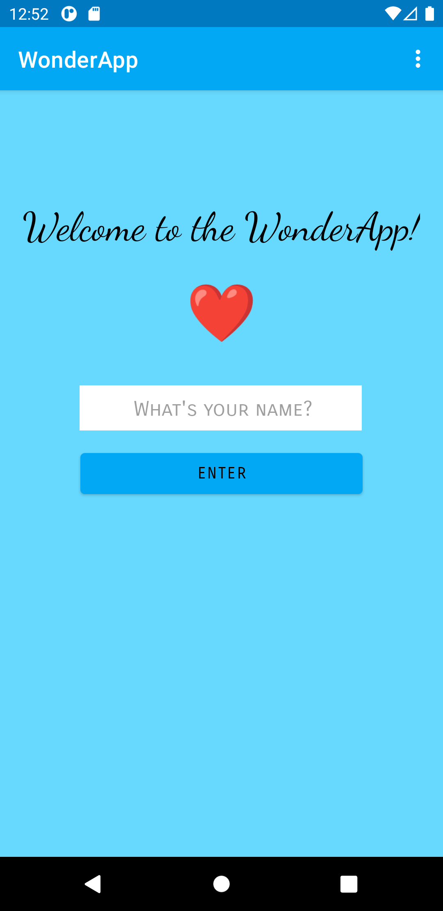
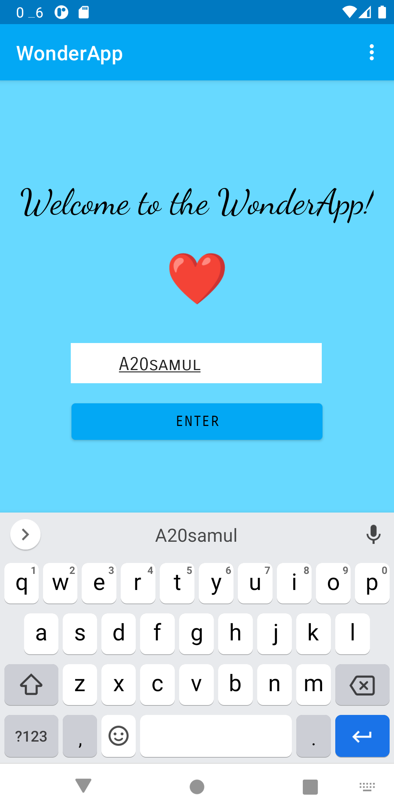
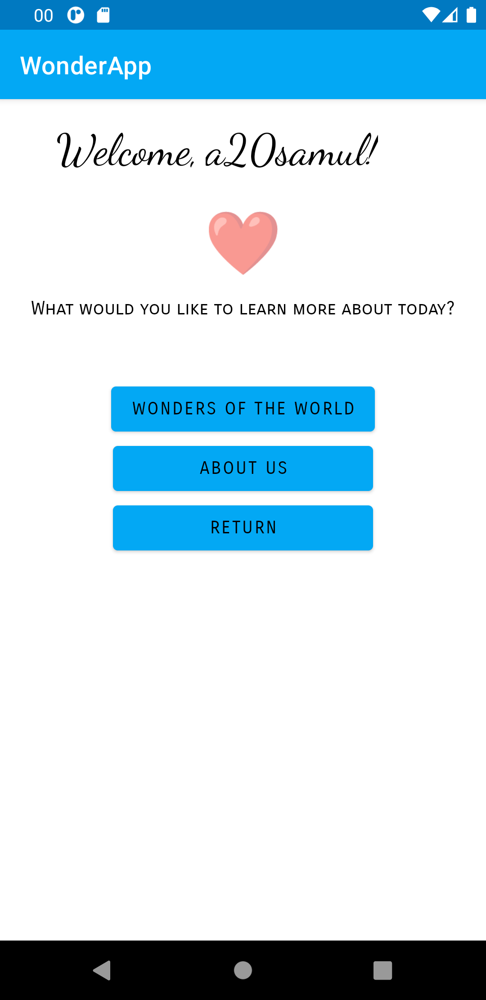
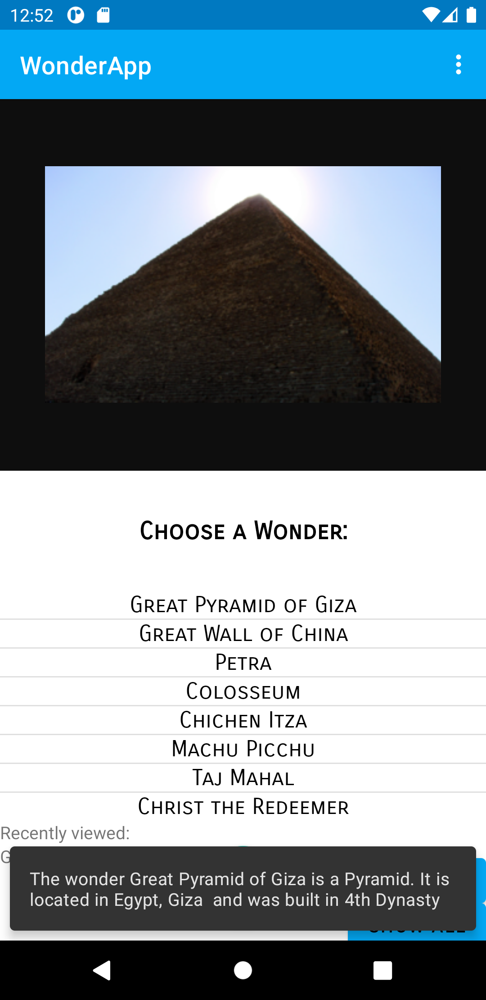
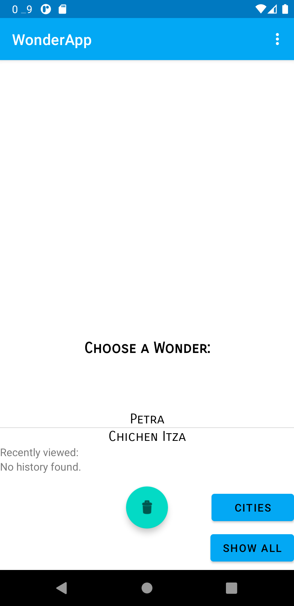

**Report**


1. Added code to be able to create a zip file


2. Enabled internet access by entering following code in AndroidManifest this
was done to be able to access and use a webservice and webview.
```
<uses-permission android:name="android.permission.INTERNET" />
```


3. Created a menu through res --> New --> Resource file called menu. Thereafter a new menu resource file
was created which was named dropdown_menu. Therein items were included which would
feature as the drop down expanded.

menu items were in a new layout resource file:
```
<?xml version="1.0" encoding="utf-8"?>
<menu xmlns:android="http://schemas.android.com/apk/res/android"
    xmlns:app="http://schemas.android.com/apk/res-auto"
    xmlns:tools="http://schemas.android.com/tools"
    tools:context="com.example.assignment5project.MainActivity">

    <item
        android:id="@+id/home_page"
        android:orderInCategory="100"
        android:title="@string/about_page"
        app:showAsAction="never" />
    <item
        android:id="@+id/about_page"
        android:orderInCategory="110"
        android:title="@string/listview_page"
        app:showAsAction="never" />
</menu>
```

Following code was added to the screen activities to show the menu.

```
    @Override
    public boolean onCreateOptionsMenu(Menu menu) {
        MenuInflater inflater = getMenuInflater();
        inflater.inflate(R.menu.dropdown_menu, menu);
        return true;
    }
```

Following code was added to create the intent of the menu items, where one led to the
home page and the other to the about page.

```
    @Override
    public boolean onOptionsItemSelected(@NonNull MenuItem item) {

        switch (item.getItemId()){
            case R.id.home_page:
                Intent intent1 = new Intent(ListviewActivity.this, MainActivity.class);
                startActivity(intent1);
                Log.d("HOME", "Successfully launched home page");
                return true;
            case R.id.about_page:
                Intent intent = new Intent(ListviewActivity.this, About.class);
                startActivity(intent);
                Log.d("ABOUT", "About page");
                return true;
        }
        return super.onOptionsItemSelected(item);
    }
```


4. Added About us page

A new Activity was added and named About. This screen was displayed through an internal webpage
added in the assets folder and accessed through webview. A return button was added to the webpage.
The webview was linked through a seperate resource file into the main resource file of the
about layout activity through:

```
 <include layout="@layout/webview" />
```

Following code enabled webview settings and loaded the internal page.

```
 myWebView = findViewById(R.id.my_webview);
        WebViewClient myWebViewClient = new WebViewClient();
        myWebView.setWebViewClient(myWebViewClient);

        WebSettings webSettings = myWebView.getSettings();
        webSettings.setJavaScriptEnabled(true);

        myWebView.loadUrl("file:///android_asset/about.html");

        Button returnButton = findViewById(R.id.return_button);
        returnButton.setOnClickListener(new View.OnClickListener() {
            @Override
            public void onClick(View view) {
                Log.d("END", "Finish app");
                finish();
            }
        });
 ```

 
 __Image 1: Displays the about page.___

5. linked edittext with a newly created activity

Another activity was created called SecondActivity
An EditText was linked whit the button where the user could type in their name to make the app
more interactive and personalised. The following code shows that by clicking a created button named
with the id enter_button which started the SecondActivity.


```
        Button enterButton = findViewById(R.id.enter_button);
        enterButton.setOnClickListener(new View.OnClickListener() {
            final EditText editText = findViewById(R.id.edit_text);

            @Override
            public void onClick(View view) {
                String myEditText = editText.getText().toString();
                Log.d("TAG", "Start SecondActivity" + myEditText);

                Intent intent = new Intent(MainActivity.this, SecondActivity.class);
                intent.putExtra("name", myEditText);


                startActivity(intent);
                Log.d("TAG", "Start SecondActivity");
            }
        });
```

__Image 2: First page__

The string was then received by SecondActivity which displayed Welcome, __inserted name__!
The user was then given three options through a series of created buttons which led to
the main page with the listview, to the about page and one which returned to home page.
All homepage buttons were executed using finish(); to not stack the screens on top of each other.


__Image 3: Sending of string.__



__Image 4: Displays the sent string.__


6. Edited appearance of theme colors and text.
The app layout was changed by changing and adding color and styles to various components of the
applications.


7. Added third activity for listview and linked it from the second activity.
This was achieved through creating buttons which linked through the creation
of intents as explained in previous step.


8. Created a new class for the ListView items named Wonders.class, which declared and created
methods for the data used in the webservice.

```
public class Wonders {
    ...
    private String name;
    ...

    public String getName() { return name;}
    ...
```

An ArrayList and an ArrayAdapter was created for the
class inside ListviewActivity.
```
    private ArrayList<Wonders> items;
    private ArrayAdapter<Wonders> adapter;

```

9. Added a listview to the third activity alongside a new resource file containing a TextView.
This textview was linked to the listview by following code:

```
 items = new ArrayList<>();
        adapter = new ArrayAdapter<Wonders>(ListviewActivity.this, R.layout.listview2, R.id.item, items);
        textView = findViewById(R.id.recentlyViewed);
        textView.setText(myPreferenceRef.getString("recentlyVisited", "No history found."));

        ListView listView = findViewById(R.id.list_view);
        listView.setAdapter(adapter);
        listView.setOnItemClickListener((parent, view, position, id) -> {
            Wonders wonder = items.get(position);

             ...

            String message = "The wonder " +  wonder.getName() + " is a " + wonder.getCategory() +
                    ". It is located in " + wonder.getLocation() + " and was built " + wonder.getCompany();

            Snackbar snackbar =  Snackbar.make(view, message,Snackbar.LENGTH_LONG).setDuration(7000);
            View snackbarView = snackbar.getView();
            TextView tv = snackbarView.findViewById(R.id.snackbar_text);
            tv.setMaxLines(3);
            snackbar.show();

            ...

        });
  ```

  
  __Image 5: Demonstrates the click of the first wonder.__

  Different components were tried and added. A Snackbar was used at last, which displayed the
  message in the string, which extracted methods from the created Java class. The duration and
  textlength were altered.

10. JsonTask/Data
JsonTask was added as provided containing the url to the webservice among other things.

Gson object was created which linked the Json data from the Wonder array. The adapter was cleared and
items were added as it also was notified if any changes were to be made in data from the webservice if
the code executed properly.
Inside onPostExecute following code was added to display the ListView:

```
        @Override
        protected void onPostExecute(String json) {
            try {
                Log.d("AsyncTask", json);
                Gson gson = new Gson();
                Wonders[] wonder = gson.fromJson(json, Wonders[].class);
                adapter.clear();
                for (int i = 0; i < wonder.length; i++) {
                    Log.d("ListviewActivity ==>", "Found a wonder: " + wonder[i]);
                    adapter.add(wonder[i]);
                }
                adapter.notifyDataSetChanged();
            } catch (Exception e) {
                Log.e("ListviewActivity ==>", "Something went wrong.");
            }
        }
```

11. webview
A WebView was added to display a page relating to the ListView items. The page was loaded by
extracting the url from the webservice and loading it into the webview window.

```
            mySecondWebView = findViewById(R.id.webView2);
            WebViewClient myWebViewClient = new WebViewClient();
            mySecondWebView.setWebViewClient(myWebViewClient);

            WebSettings webSettings = mySecondWebView.getSettings();
            webSettings.setJavaScriptEnabled(true);

            mySecondWebView.loadUrl(wonder.getAuxdata());
```

12. Shared preferences
A "Recently Viewed" -item was added in the form av two TextViews.
The following were declared:
```
    private SharedPreferences myPreferenceRef;
    private SharedPreferences.Editor myPreferenceEditor;
    private TextView textView;
```

Was added in onCreate:
```
myPreferenceRef = getPreferences(MODE_PRIVATE);
myPreferenceEditor = myPreferenceRef.edit();
```
Which stored the recently viewed item by getting the name:
```
            textView.setText(wonder.getName());
            // Store the new preference
            myPreferenceEditor.putString("recentlyVisited", wonder.getName());
            myPreferenceEditor.apply();
```


13. Clear history

The option to clear the saved history was added.
```
        FloatingActionButton fab = findViewById(R.id.fab);
        fab.setOnClickListener(new View.OnClickListener() {
            @Override
            public void onClick(View view) {
                textView.setText("");
                myPreferenceEditor.clear();
                myPreferenceEditor.commit();
                Log.d("==>","You have cleared the history");
            }
        });
```

14. A database was added with belonging code inside two classes named DatabaseTables and DatabaseHelper.
Therein the table for the data were made with a few adjustments to the code that was supplied.
Parameteres were added in the Wonders.class as well.
Thereafter code was added for insertion of data into database with the method called insertWonders.
insertWonder(m) was added alongside the code in onPostExecute which inserted the data into the database.
Two methods called fetchWonders(); and fetchAllWonders(); were created.

A new preference was created using following code and entering the key as "filter"":
```
 String fetch = myPreferenceRef.getString("filter", "No history found.");
        Log.d("fetch", fetch);
```

This enabled the use of selections. Had the Filter button been pressed, the temporary list tempWonders = fetchWonders();
which was created, the filtered version the category to display the category wanted was displayed alongside a
shared preference to save the filtered version if the application was exited:

```
        myPreferenceEditor.putString("filter", "Filtered");
        myPreferenceEditor.apply();

      //  results WHERE "title" = 'My Title'
        String selection = DatabaseTables.Wonders.COLUMN_NAME_CATEGORY + " = ?";
        String[] selectionArgs = { "City" };
```

Same code was added to fetchAllWonders(); except for the filter and changed to Unfiltered:

```
        myPreferenceEditor.putString("filter", "Unfiltered");
        myPreferenceEditor.apply();
```
The selections were used to filter the data. If no history was found data from the webservice was called.
If the "Filter"-button was pressed the List<Wonder> created for the purpose of filtering was shown, wherein
the list was specified as tempWonders extracted from fetchWonders. The adapter was cleared to be able
to add the data from tempWonder and was notified of the data change. Same was done for the unfiltered data
which included all the data from fetchAllWonders();.


```
 if(fetch=="No history found.") {
            new JsonTask().execute("https://wwwlab.iit.his.se/brom/kurser/mobilprog/dbservice/admin/getdataasjson.php?type=a20samul");
            myPreferenceEditor.putString("filter", "Unfiltered");
            myPreferenceEditor.apply();
        }
        else if (fetch.equals("Unfiltered")){
            List<Wonders> tempWonders = fetchAllWonders();
            adapter.clear();
            for (int i = 0; i < tempWonders.size(); i++) {
                //tempWonders.get(i); returns a wonder
                Log.d("ListviewActivity ==>", "Found a wonder: " + tempWonders.get(i));
                adapter.add(tempWonders.get(i));
            }
            adapter.notifyDataSetChanged();
        }
        else if (fetch.equals("Filtered")){
            List<Wonders> tempWonders = fetchWonders();
            adapter.clear();
            for (int i = 0; i < tempWonders.size(); i++) {
                //tempWonders.get(i); returnerar ett wonder
                Log.d("ListviewActivity ==>", "Found a wonder: " + tempWonders.get(i));
                adapter.add(tempWonders.get(i));
            }
            adapter.notifyDataSetChanged();
        }
        else{
            Log.d("Something happened", "fetch:" + fetch);
        }
    }
```


__Image 6: Displays when filtered by cities.__


